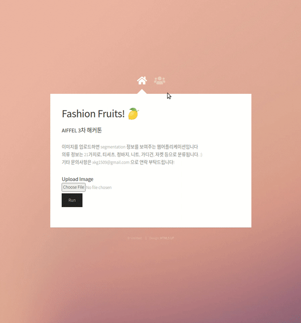

# 🍊 Fashion Fruits! 🍋

[](https://ainize.web.app/redirect?git_repo=https://github.com/jiyeoon/fashion-fruits)



이미지를 입력하면 이미지를 Segmentation한 정보를 보여주는 웹 어플리케이션입니다.

mmdetection을 활용해 의류 segmentation 정보를 출력하고, 학습에 사용된 데이터는 [K-fashion 데이터셋](https://dacon.io/competitions/official/235672/overview/)입니다.


# 개발 환경

- Ubuntu 16.04
- Python 3.7


# 환경 셋팅

```
$ pip install requirements.txt
$ flask run
```

